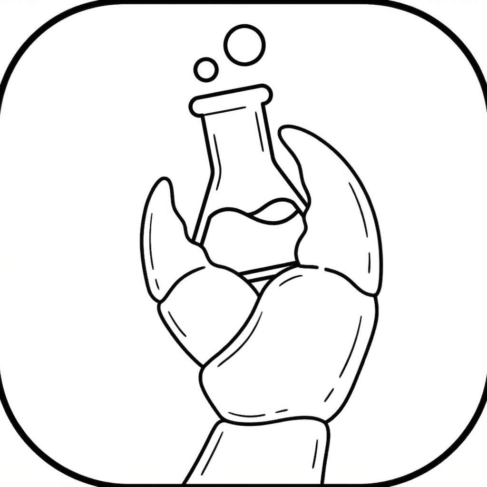
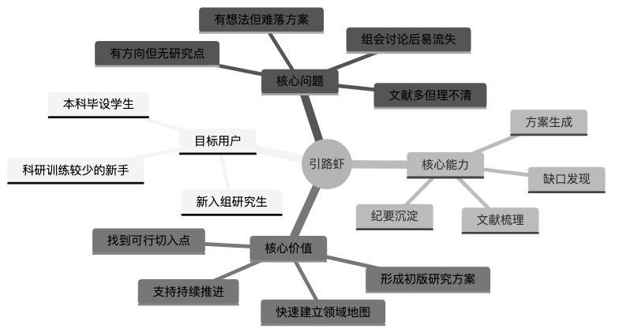
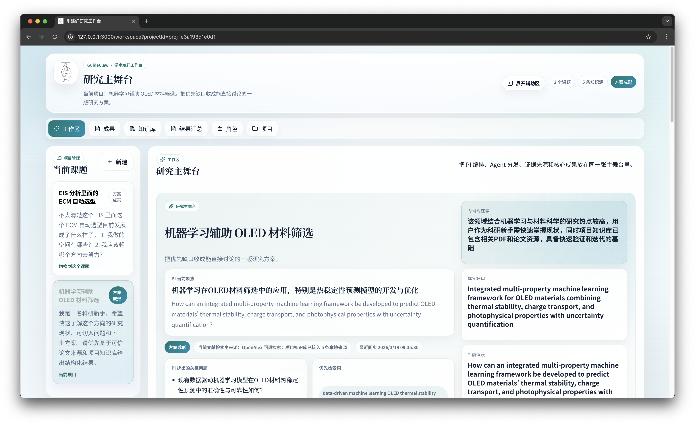
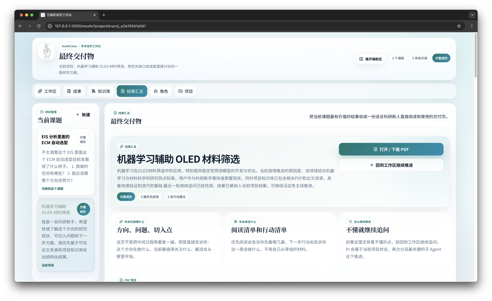
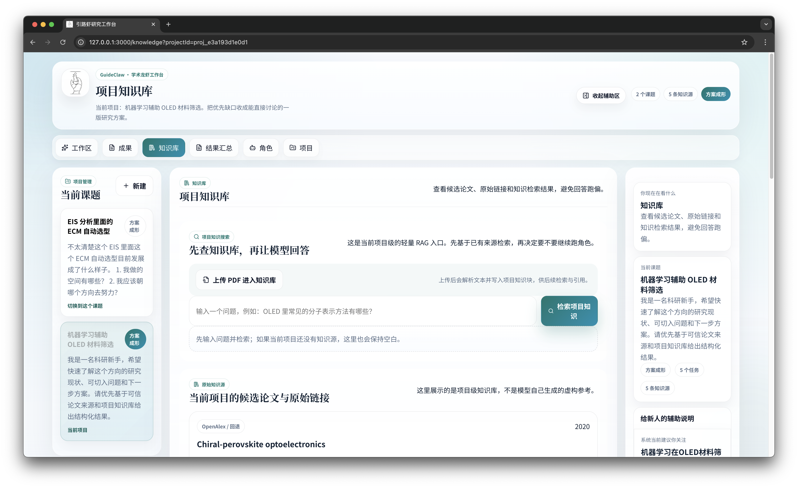
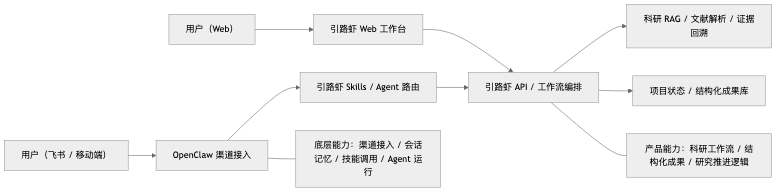

<p align="center">
  
</p>

<h1 align="center">引路虾 GuideClaw</h1>

<p align="center">
  面向科研新人的研究导航工作台
</p>

<p align="center">
  
  
  
  
  
</p>

引路虾是一套面向科研新人的**研究导航工作台**。它不是单纯的论文问答工具，也不是“聊天窗里堆很多 skills”的技能集合，而是把一个陌生课题推进成一条可持续推进的科研工作流：

- `PI` 收敛研究焦点、关键问题与下一步优先级
- `文献助理` 检索并整理候选文献与证据
- `选题分析员` 识别优先研究缺口
- `方案设计师` 生成首轮研究方案
- `组会秘书` 沉淀纪要、待办和后续行动

最终，系统会把这些过程收敛成一个**结果汇总**页面与可下载的 **PDF**，适合科研新人用于开题、组会和方向入门。

当前演示版默认基座模型：

- **`openrouter/free`**

说明：

- Web 工作台与 FastAPI 后端通过 OpenRouter 兼容接口调用模型
- OpenClaw 负责角色执行与 skills 调用
- 基座模型可通过 `OPENROUTER_MODEL` 自行替换



## 项目特点

- **面向科研新人**：从“我不知道这个方向怎么开始”推进到“我已经有一版可讨论方案”
- **项目级工作区**：一个课题一个独立项目，支持多课题并行推进
- **PI 编排式多 Agent 协作**：不是多个 prompt 排队，而是围绕同一项目上下文接力工作
- **项目级知识库**：支持 PDF 上传、知识源沉淀、知识块检索与继续追问
- **结果可交付**：支持网页查看、PDF 预览、PDF 下载，不只是聊天记录
- **本地优先 + OpenClaw 执行**：Web 与后端负责产品和数据，OpenClaw 负责角色执行和 skills 调用

## 实际运行界面

### 1. 工作区

工作区突出 `PI 编排 -> Agent 执行 -> 成果沉淀` 的主流程，中间是主舞台，两侧是辅助信息。



### 2. 结果汇总

结果汇总页会把最有价值的内容集中交付，支持网页阅读和 PDF 导出。



### 3. 项目级知识库

知识库页面展示论文源、PDF 上传结果、知识搜索和原始链接，尽量降低幻觉、强化可回溯性。



## 适合解决什么问题

引路虾特别适合以下场景：

- 本科毕业设计刚确定方向，但不知道从哪里开始
- 刚进入课题组，需要快速理解一个陌生领域
- 组会前要梳理文献、缺口和方案
- 组会后想把讨论沉淀成结构化成果
- 希望把零散研究过程，整理成持续推进的项目档案

## 系统架构

当前采用的是：

```text
Next.js 工作台 -> FastAPI -> OpenClaw CLI（按需执行）
```

职责边界如下：

- **GuideClaw**
  - 项目管理
  - 科研工作流编排
  - SQLite 持久化
  - 项目知识库 / PDF 解析 / 轻量 RAG
  - 结构化成果卡与结果汇总页
- **OpenClaw**
  - 角色执行入口
  - workspace skills 运行
  - 本地 agent turn 与上下文承接

当前 OpenClaw 不是独立常驻的 gateway 服务，而是由 FastAPI 在需要时按需调用 CLI。



## 仓库结构

```text
apps/
  web/              # Next.js 前端工作台
services/
  api/              # FastAPI 后端、工作流、知识库、持久化
skills/             # GuideClaw 角色 skills 与文献相关 skills
openclaw/           # OpenClaw 配置模板与接入说明
docs/               # 项目介绍、演示说明、上传清单、优化路线图
scripts/            # 本地辅助脚本
data/
  samples/          # 示例资源占位
```

## 快速开始

### 1. 安装前置依赖

- Node.js 20+
- `pnpm`
- Python 3.11+
- 全局 `openclaw` CLI

建议安装方式：

```bash
npm install -g pnpm
npm install -g openclaw@latest
```

### 2. 一行准备本地接入

如果你希望以“更像插件 / 一键接入”的方式，把 GuideClaw 接到自己的 OpenClaw 与本地环境里，先执行：

```bash
bash scripts/install-guideclaw.sh
```

这个脚本会：

- 创建 `services/api/.env.local`
- 创建 `openclaw/.env.local`
- 自动写入当前仓库路径
- 默认把基座模型设为 `openrouter/free`
- 提示你下一步启动前后端与检查 skills 的命令

### 3. 安装前端依赖

在仓库根目录执行：

```bash
pnpm install
```

### 4. 配置后端环境变量

在 `services/api` 目录下：

```bash
cp .env.example .env.local
```

至少需要补这些变量：

- `OPENROUTER_API_KEY`
- `OPENROUTER_MODEL`（默认 `openrouter/free`）
- `GUIDECLAW_API_BASE_URL=http://127.0.0.1:8000`
- `GUIDECLAW_DATABASE_PATH=./data/guideclaw.db`

如果你还想启用 Bohrium 相关文献 skills，可以再配置：

- `BOHRIUM_ACCESS_KEY`

### 5. 启动后端

推荐在 `services/api` 目录下建立虚拟环境后运行：

```bash
cd services/api
python3 -m venv .venv
source .venv/bin/activate
pip install -e .
uvicorn app.main:app --reload --host 127.0.0.1 --port 8000
```

### 6. 启动前端

回到仓库根目录：

```bash
pnpm --filter @guideclaw/web dev
```

默认访问：

- Web：`http://127.0.0.1:3000`
- API：`http://127.0.0.1:8000`

## 如何与 OpenClaw 结合使用

本项目不是把 OpenClaw 官方源码直接塞进仓库，而是采用 **workspace skills + CLI 按需执行** 的集成方式。

当前演示版默认基座模型同样是：

- **`openrouter/free`**

### 第一步：准备 OpenClaw 本地配置

参考：

- [openclaw/README.md](openclaw/README.md)
- [openclaw/install-and-integration.md](openclaw/install-and-integration.md)
- [openclaw/openclaw.config.template.yml](openclaw/openclaw.config.template.yml)
- [openclaw/openclaw.env.example](openclaw/openclaw.env.example)

### 第二步：确保 OpenClaw 能识别当前工作区 skills

在仓库根目录执行：

```bash
GUIDECLAW_API_BASE_URL=http://127.0.0.1:8000 \
openclaw --profile guideclaw skills list
```

如果环境变量完整，应该能看到：

- `guideclaw-principal-investigator`
- `guideclaw-literature-assistant`
- `guideclaw-gap-analyst`
- `guideclaw-study-designer`
- `guideclaw-meeting-secretary`

以及可选的：

- `bohrium-paper-search`
- `bohrium-pdf-parser`
- `bohrium-knowledge-base`
- `web-search`
- `proposal-agent`
- `preparation-agent`

### 第三步：在 Web 工作台里触发 OpenClaw 执行

当前调用链路是：

```text
Web 工作台 -> FastAPI -> openclaw CLI (--local --json) -> 角色输出
```

也就是说：

1. 你在工作台里点击运行角色或继续追问
2. 后端将当前项目 ID、API 地址和上下文注入 OpenClaw
3. OpenClaw 调用对应 workspace skill
4. 角色输出回写到数据库，并在前端以 Markdown / 文档形式展示

## 使用方式

### 路径一：创建新课题并跑首轮调查

1. 打开 `/projects`
2. 输入课题标题和背景说明
3. 创建项目后进入工作区
4. 运行首轮调查
5. 查看文献卡、缺口卡、方案卡、纪要卡

### 路径二：上传 PDF 并进入知识库

1. 打开 `/knowledge?projectId=...`
2. 上传 PDF
3. 查看知识源与知识块
4. 通过项目知识搜索回看重点内容

### 路径三：继续追问

1. 打开 `/workspace?projectId=...`
2. 在“继续追问”里提出更具体的问题
3. 由 PI 再次拆题并下发给最关键的子 Agent
4. 结果写入项目文档档案并刷新工作区内容

### 路径四：查看最终交付

1. 打开 `/results?projectId=...`
2. 查看结果汇总
3. 直接预览 PDF
4. 下载 PDF 用于开题、组会或分享

## 核心能力清单

- 多项目管理：每个课题一个独立工作区
- PI 编排式多 Agent 协作
- SQLite 持久化：项目、成果卡、知识源、知识块、生成文档
- PDF 上传与解析
- 项目级知识检索
- 轻量 RAG 与证据链
- 原始来源链接、DOI、页码范围展示
- 局部英文翻译
- 继续追问
- 结果汇总页面
- PDF 导出

## 已验证项

- `pnpm --filter @guideclaw/web typecheck`
- `pnpm --filter @guideclaw/web build`
- `python3 -m compileall services/api/app`
- OpenClaw CLI 可真实执行角色
- `/projects/{id}/agent-run` 可返回真实 Markdown 结果
- 结果汇总支持网页、JSON、PDF 三种形式

## 演示建议路径

最适合录视频或给评委看的顺序：

1. **结果汇总页**：先展示最终交付物
2. **工作区**：展示 PI 编排与多 Agent 协作
3. **知识库页**：展示 PDF、知识源、原始链接
4. **角色页**：展示 OpenClaw 真实执行

## 文档

- [项目介绍评审稿](docs/guideclaw-project-introduction.md)

## 当前状态说明

当前版本属于：

> **完整、可运行、可演示、可参赛的高完成度参赛版**

它已经不是空壳，也不是只会调 skills 的聊天 demo，而是一个：

- 有项目上下文
- 有知识库
- 有工作流
- 有持久化
- 有最终交付页
- 有 OpenClaw 真实执行链路

的科研工作系统。
