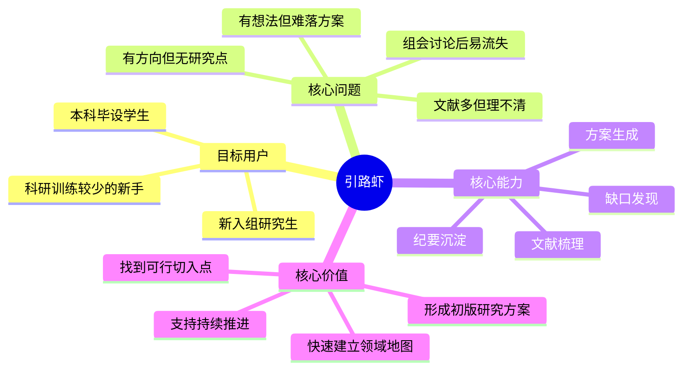
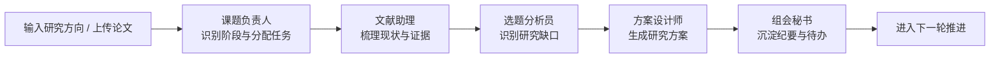
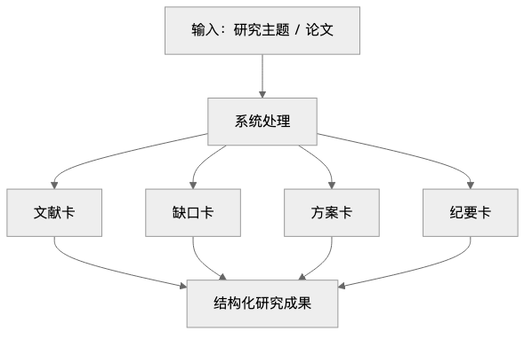
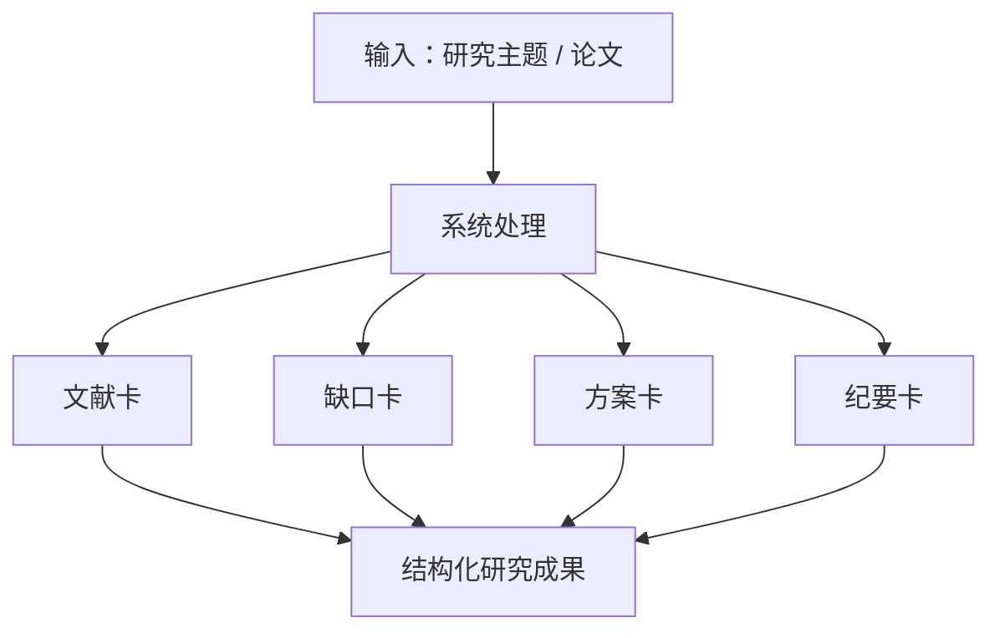
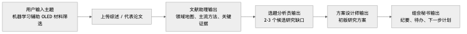
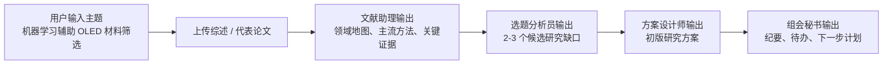
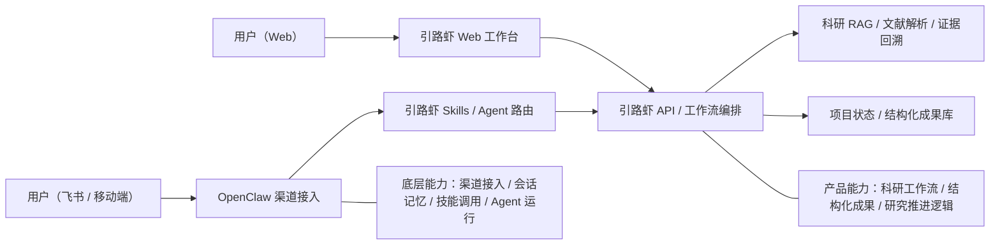
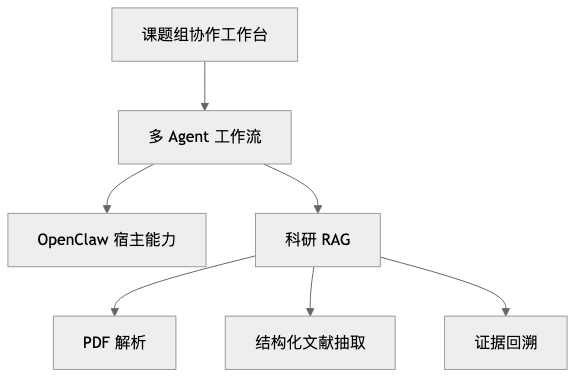
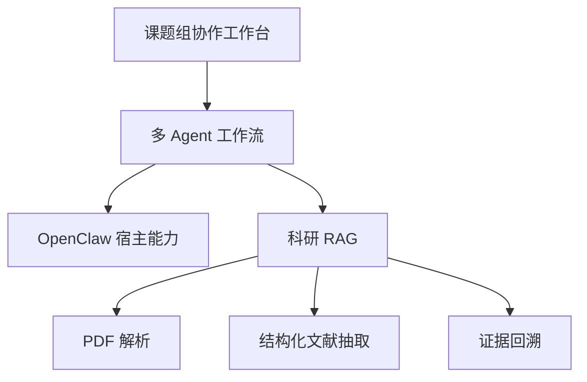

# 引路虾（GuideClaw）项目介绍（评审版）

> 引路虾是一套面向科研新人的课题组选题推进系统。它基于多 Agent 协同与科研 RAG，帮助用户从文献梳理走到研究缺口发现、研究方案生成与组会沉淀，提升科研前期的入门效率与推进效率。

## 一、项目基本信息

| 项目项 | 内容 |
| --- | --- |
| 项目名称 | 引路虾 |
| 英文名称 | GuideClaw |
| 参赛赛道 | 学术龙虾 |
| 项目定位 | 面向科研新人的课题组选题推进系统 |
| 核心能力 | 文献梳理、领域概览、研究缺口发现、方案生成、组会沉淀 |
| 目标用户 | 本科毕设学生、刚进入课题组的研究生、科研训练较少的新手研究者 |

## 二、项目简介

科研新人进入一个全新方向时，最难的往往不是“读懂一篇论文”，而是如何从大量零散信息中快速建立领域认知，进一步找到可研究的问题，并把模糊想法收敛成一版可讨论、可汇报、可推进的研究方案。

引路虾围绕这一真实需求，聚焦科研前期最核心的三个问题：

- 什么值得研究？
- 为什么值得研究？
- 下一步该怎么做？

它不是一个普通的论文问答工具，而是一个把“方向摸索、文献梳理、缺口分析、方案生成、组会沉淀”串成闭环的研究导航系统。

### 项目全景图

查看 Mermaid 源码

## 三、项目背景与痛点

学术龙虾赛道关注“搞懂一件事”的真实场景，而科研前期正是这一场景的典型代表。对于科研新人来说，常见问题主要集中在以下几个方面：

| 典型问题 | 具体表现 | 引路虾对应能力 |
| --- | --- | --- |
| 文献多但理不清 | 不清楚领域现状、主流方法、数据来源、关键指标 | 文献检索、结构化抽取、领域概览 |
| 有方向但无研究点 | 只有大方向，难以收缩成可研究的问题 | 研究缺口发现、候选切入点分析 |
| 有想法但难落方案 | 边界不清、数据不明、指标模糊 | 研究方案生成、验证路径设计 |
| 组会讨论后易流失 | 结论不清、待办不明、推进断裂 | 组会纪要沉淀、后续任务整理 |

引路虾的目标，是帮助科研新人更快完成一个研究方向的前期调研、选题分析与开题准备。

## 四、目标用户与适用场景

### 目标用户

- 本科毕业设计学生
- 刚进入课题组的研究生
- 科研训练较少的新手研究者
- 需要快速完成文献梳理、开题准备或组会汇报的人

### 适用场景

- 选题前的方向摸索
- 开题前的文献梳理
- 组会前的材料准备
- 组会后的纪要与待办沉淀
- 对某一研究方向进行快速入门

## 五、核心方案：课题组协同式研究导航

引路虾将科研前期流程拆成五个角色，让系统不只是“回答问题”，而是像一个真实课题组一样分工协作、逐步推进。

### 五个核心角色

| 角色 | 核心职责 | 主要产出 |
| --- | --- | --- |
| 课题负责人 | 理解用户目标，判断当前研究阶段，安排后续任务 | 阶段判断、任务分解、推进建议 |
| 文献助理 | 查找文献、解析 PDF、整理代表工作、提取关键证据 | 文献卡、领域概览、证据片段 |
| 选题分析员 | 识别潜在研究缺口，并判断其新颖性、重要性、可行性 | 缺口卡、候选研究点、优先级分析 |
| 方案设计师 | 将方向进一步落为一版研究方案 | 方案卡、研究边界、数据与指标设计 |
| 组会秘书 | 沉淀讨论内容、结论、待办与下一步计划 | 会议纪要、待办清单、推进计划 |

### 协同流程图

查看 Mermaid 源码

### 实际运行界面

以下截图来自当前可运行版本，展示了引路虾并非概念化流程图，而是已经具备真实工作区、结果交付页和项目知识库的系统形态。

#### 1. 工作区主舞台

工作区强调“PI 编排 + Agent 分发 + 当前成果 + 知识入口”的主流程，帮助科研新人先看清这轮研究到底在解决什么，再继续追问或查看成果。

#### 2. 结果汇总页

结果汇总页是面向科研新人的最终交付物。系统会把最有价值的结果收成统一页面，并支持 PDF 预览与下载，方便直接用于开题、汇报和后续推进。

#### 3. 项目知识库

项目知识库支持候选论文、原始链接和项目内检索，也支持 PDF 上传后进入项目级知识层，为后续 RAG 和证据追溯提供基础。

## 六、核心功能

### 1. 文献检索与解析

用户输入研究主题或上传 PDF 后，系统能够自动整理文献并抽取结构化信息，包括：

- 研究问题
- 方法路线
- 数据来源
- 核心结果
- 局限与不足
- 原文证据片段

### 2. 文献梳理与领域概览

系统会对多篇文献进行归纳，帮助用户快速看清：

- 当前领域主要在研究什么
- 常见方法有哪些
- 当前的共识和争议分别是什么
- 已有工作的边界和不足在哪里

### 3. 研究缺口发现

系统基于文献梳理结果，辅助用户发现潜在研究缺口，例如：

- 现实场景中未解决的问题
- 理论或机制上的空白
- 现有方法的明显缺陷
- 新工具或新数据出现后带来的研究机会

### 4. 研究方案生成

围绕选定问题，系统帮助用户生成一版初步方案，包括：

- 研究问题陈述
- 研究对象与边界
- 数据来源
- 评价指标
- 候选方法
- 验证思路

### 5. 组会纪要与待办沉淀

系统支持将讨论过程转化为结构化成果，包括：

- 会议结论
- 尚未解决的问题
- 待办事项
- 下一轮研究推进方向

### 输出成果示意

查看 Mermaid 源码

## 七、典型案例：机器学习辅助 OLED 材料筛选

### 场景说明

以“机器学习辅助 OLED 材料筛选”为例，科研新人通常会遇到以下问题：

- 这个方向的文献应该从哪里开始查
- 前人主要做到了什么程度
- 目前还有哪些值得研究的切入点
- 如何将大方向收缩成一个可执行的研究方案

### 系统演示流程

查看 Mermaid 源码

### 本案例中，引路虾的价值

- 帮助用户快速建立该领域的基础认知
- 帮助用户判断“什么值得做”，而不是停留在“看了很多论文”
- 帮助用户从大方向走到初版研究方案
- 帮助用户把一次性讨论转成可持续推进的研究过程

## 八、项目创新点与差异化

### 1. 从“论文问答”升级为“研究导航”

很多现有工具主要停留在摘要、翻译和问答层面，而引路虾重点解决的是：

- 什么值得研究
- 为什么值得研究
- 如何把方向落成方案
- 下一步如何持续推进

### 2. 模拟真实课题组协作

系统采用多角色分工机制，更符合科研工作真实流程，也更容易让用户理解系统各个环节的作用。

### 3. 明确服务科研新人

项目面向“刚入门、还不会做”的用户群体，目标是降低科研前期门槛，而不是服务已经具备成熟科研训练的专家型用户。

### 4. 输出结构化成果

引路虾输出的不是零散对话，而是可以直接复用的结构化成果，例如文献卡、缺口卡、方案卡和纪要卡，可直接服务于开题、组会与后续推进。

### 5. 强调证据可追溯

系统的重要结论会尽量附带文献来源和证据片段，以提升科研场景中的可信度和可解释性。

## 九、技术思路

引路虾采用“前端工作台 + 多 Agent 工作流 + OpenClaw 宿主能力 + 科研 RAG”的整体方案。

- OpenClaw 负责多角色执行、工具调用、技能扩展与会话记忆
- 多 Agent 工作流负责按研究阶段调度不同角色
- 科研 RAG 负责文献解析、结构化抽取与证据回溯
- 前端工作台负责把研究推进过程可视化展示出来

### 引路虾与 OpenClaw 的关系

从系统角色上看，引路虾是一个独立的科研导航应用，OpenClaw 是其底层智能基础设施。

- 引路虾负责：科研工作流、结构化成果、研究推进逻辑、前端工作台
- OpenClaw 负责：Agent 运行、技能调用、渠道接入、会话记忆

查看 Mermaid 源码

### 技术结构图

查看 Mermaid 源码

## 十、安全与边界说明

为了确保系统在科研场景中的可控性和可靠性，引路虾在设计上明确以下边界：

- 系统仅处理用户上传或授权访问的文献与资料
- 关键结论尽量附带来源与证据片段
- 输出仅作为科研辅助，不替代研究者的最终学术判断
- 系统聚焦科研前期调研、选题与方案辅助，不直接替代正式科研结论与实验验证
- 工具与插件仅在可信范围内使用，避免非授权数据访问
- 尊重文献版权、知识产权与原作者权益

## 十一、总结

引路虾面向的是科研新人最容易卡住、也最需要支持的那一段路：从进入一个新方向，到形成一版真正可以讨论和推进的研究方案。

它的核心价值不在于替代科研，而在于把分散的文献、模糊的想法和零散的讨论，逐步收敛成结构化、可执行、可持续推进的研究成果。

相比传统论文问答工具，引路虾更像一个真正参与课题推进的协作系统。它不仅帮助用户“看懂文献”，更帮助用户“搞懂一件值得研究的事”，并知道下一步该如何行动。
